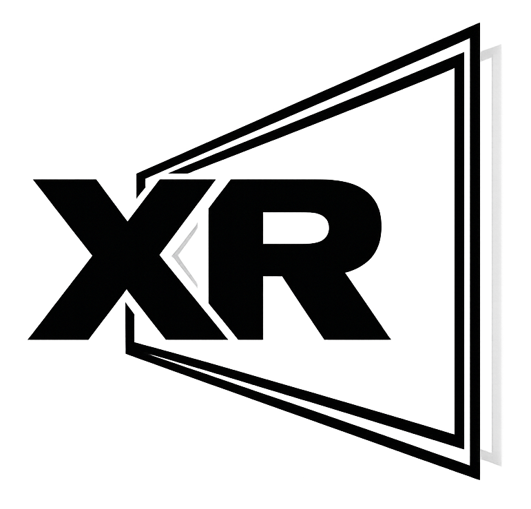

<picture>
  <source media="(prefers-color-scheme: dark)" srcset="assets/displayxr_white.png" width="120">
  <source media="(prefers-color-scheme: light)" srcset="assets/displayxr.png" width="120">
  
</picture>

# DisplayXR Runtime

[](https://github.com/DisplayXR/displayxr-runtime/actions/workflows/build-windows.yml)
[](https://github.com/DisplayXR/displayxr-runtime/actions/workflows/build-macos.yml)
[](LICENSE)

An open-source [OpenXR](https://www.khronos.org/openxr/) runtime for spatial displays — 3D monitors and laptops with tracked stereo and multiview lightfield display technology.

Built on [Monado](https://monado.freedesktop.org/) by Collabora, DisplayXR strips away headset-centric infrastructure (34 VR drivers, Vulkan server compositor, tracking subsystems) and replaces it with a lightweight runtime purpose-built for 3D displays: ~150 files, 3 drivers, native compositors for every graphics API.

## Architecture

```
App (any graphics API)
        |
   OpenXR State Tracker
        |
   Core xrt interfaces
        |
   +----+-----+--------+--------+
   |    |     |        |        |
 D3D11 D3D12 Vulkan  Metal   OpenGL   ← native compositors
   |    |     |        |        |
   Display Processor (LeiaSR / sim_display)
        |
   Display
```

Every graphics API gets its own native compositor — no Vulkan intermediary, no interop overhead. Vendor-specific processing (interlacing, lenticular weaving) is isolated in the display processor layer.

| API | Windows | macOS |
|-----|---------|-------|
| D3D11 | Shipping | — |
| D3D12 | Shipping | — |
| Metal | — | Shipping |
| OpenGL | Shipping | Shipping |
| Vulkan | Shipping | Shipping |

## Quick Start

### One-command dev install

```bash
# macOS
git clone https://github.com/DisplayXR/displayxr-runtime
cd displayxr-runtime
./scripts/setup-displayxr.sh                  # runtime + sim-display
./scripts/setup-displayxr.sh --with mcp       # also DisplayXR MCP Tools (AI-agent / voice control)
```

```bat
:: Windows — run from an ELEVATED command prompt
git clone https://github.com/DisplayXR/displayxr-runtime
cd displayxr-runtime
scripts\setup-displayxr.bat                   :: runtime + Shell + Leia plug-in
scripts\setup-displayxr.bat --with mcp        :: also DisplayXR MCP Tools (AI-agent / voice control)
```

Downloads each component's installer from its GitHub Releases page (versions pinned in [`versions.json`](versions.json)), runs it silently, verifies the install. See [`docs/getting-started/full-stack-install.md`](docs/getting-started/full-stack-install.md) for `--with-demos`, `--dry-run`, `--uninstall`, and the per-component platform availability matrix.

### Manual install

For full control, install each component directly from its release page. Order: runtime → Shell → Leia plug-in → MCP Tools.

| Component | Windows | macOS |
|---|---|---|
| **DisplayXR Runtime** (required) | [`DisplayXRSetup-*.exe`](https://github.com/DisplayXR/displayxr-runtime/releases) | [`DisplayXR-Installer-*.pkg`](https://github.com/DisplayXR/displayxr-runtime/releases) |
| **DisplayXR Shell** (optional, spatial workspace UX) | [`DisplayXRShellSetup-*.exe`](https://github.com/DisplayXR/displayxr-shell-releases/releases) | — (deferred) |
| **Leia SR plug-in** (Leia hardware only) | [`DisplayXRLeiaSRSetup-*.exe`](https://github.com/DisplayXR/displayxr-leia-plugin/releases) | — (vendor SDK is Windows-only) |
| **MCP Tools** (optional, AI-agent / voice control) | [`DisplayXRMCPSetup-*.exe`](https://github.com/DisplayXR/displayxr-mcp/releases) | — (future) |

The website's [Get Started](https://displayxr.org/getting-started) page walks through the manual flow end-to-end with verification steps.

### Build from source

```bash
# Windows — auto-fetches vcpkg + OpenXR loader (no vendor SDK; Leia ships as a separate plug-in)
scripts\build_windows.bat all
# Outputs: _package/DisplayXRSetup-*.exe (installer) + _package/bin/

# macOS — runtime + sim-display plug-in + .pkg installer
brew install cmake ninja eigen vulkan-sdk && ./scripts/build_macos.sh --installer
# Outputs: _package/DisplayXR-Installer-*.pkg (installer) + _package/DisplayXR-macOS/
# Install: sudo installer -pkg _package/DisplayXR-Installer-*.pkg -target /
# (Gatekeeper warns on double-click — the .pkg is unsigned today; sudo installer
#  from terminal bypasses Gatekeeper. Notarization tracked in issues #280/#281.)

# Run a dev build without installing
XR_RUNTIME_JSON=./build/Release/openxr_displayxr-dev.json ./your_openxr_app
```

See [Building DisplayXR](docs/getting-started/building.md) for full instructions and CMake options.

## Simulation Driver

No 3D display required. The **sim_display** driver provides a simulated tracked display with WASD + mouse eye position control:

```bash
XR_RUNTIME_JSON=./build/openxr_displayxr-dev.json ./build/test_apps/cube_handle_vk_macos/cube_handle_vk_macos
```

## Documentation

| I want to... | Start here |
|---|---|
| **Build apps** for 3D displays | [Getting Started](docs/getting-started/overview.md) |
| **Contribute** to DisplayXR | [Contributing Guide](docs/guides/contributing.md) |
| **Integrate my display** hardware | [Vendor Plug-in Onboarding](docs/guides/vendor-plugin-onboarding.md) |
| See the full docs index | [Documentation Index](docs/README.md) |
| See the project roadmap | [Roadmap](docs/roadmap/overview.md) |

### Key References

- [App Classes](docs/getting-started/app-classes.md) — handle, texture, hosted, IPC
- [XR_EXT_display_info](docs/specs/extensions/XR_EXT_display_info.md) — display properties and rendering mode extension
- [Kooima Projection](docs/architecture/kooima-projection.md) — stereo math and projection pipelines
- [Separation of Concerns](docs/architecture/separation-of-concerns.md) — layer boundaries
- [displayxr-mcp](https://github.com/DisplayXR/displayxr-mcp) — embeddable MCP server framework. End users opt in to AI-agent / voice control by installing **DisplayXR MCP Tools** ([releases](https://github.com/DisplayXR/displayxr-mcp/releases)), which writes `HKLM\Software\DisplayXR\Capabilities\MCP\Enabled=1`; the runtime reads this at startup and spawns a per-app MCP server. `DISPLAYXR_MCP=1` (or `=0`) is still supported as a process-local override for CI / dev. Runtime registers Phase A handle-app introspection tools (`list_sessions`, `get_display_info`, `capture_frame`, `tail_log`, …) per app process; the reference shell hosts Phase B workspace tools. Spec at [`displayxr-mcp/docs/mcp-spec.md`](https://github.com/DisplayXR/displayxr-mcp/blob/main/docs/mcp-spec.md).

## Related Repos

| Repo | Description |
|------|-------------|
| [displayxr-installer](https://github.com/DisplayXR/displayxr-installer) | Meta-installer — one bundle that installs runtime + Shell + plug-ins |
| [displayxr-shell-releases](https://github.com/DisplayXR/displayxr-shell-releases) | DisplayXR Shell — spatial workspace controller (installer + bug reports) |
| [displayxr-leia-plugin](https://github.com/DisplayXR/displayxr-leia-plugin) | Leia SR display-processor plug-in (`DisplayXRLeiaSRSetup-*.exe`) |
| [displayxr-extensions](https://github.com/DisplayXR/displayxr-extensions) | OpenXR extension specs and headers |
| [displayxr-mcp](https://github.com/DisplayXR/displayxr-mcp) | Embeddable MCP server framework + **DisplayXR MCP Tools** installer (end-user opt-in for agent / voice control) |
| [displayxr-demo-gaussiansplat](https://github.com/DisplayXR/displayxr-demo-gaussiansplat) | 3D Gaussian Splatting reference demo |
| [displayxr-unity](https://github.com/DisplayXR/displayxr-unity) | Unity engine plugin (UPM package) |
| [displayxr-unreal](https://github.com/DisplayXR/displayxr-unreal) | Unreal Engine plugin |
| [displayxr-common](https://github.com/DisplayXR/displayxr-common) | Generalized off-axis frustum projection math library (`displayxr::math` + `displayxr::common`) |

## Contributing

We welcome contributions! See the [contributing guide](docs/guides/contributing.md) for workflow, code style, and CI expectations.

## License

Boost Software License 1.0
