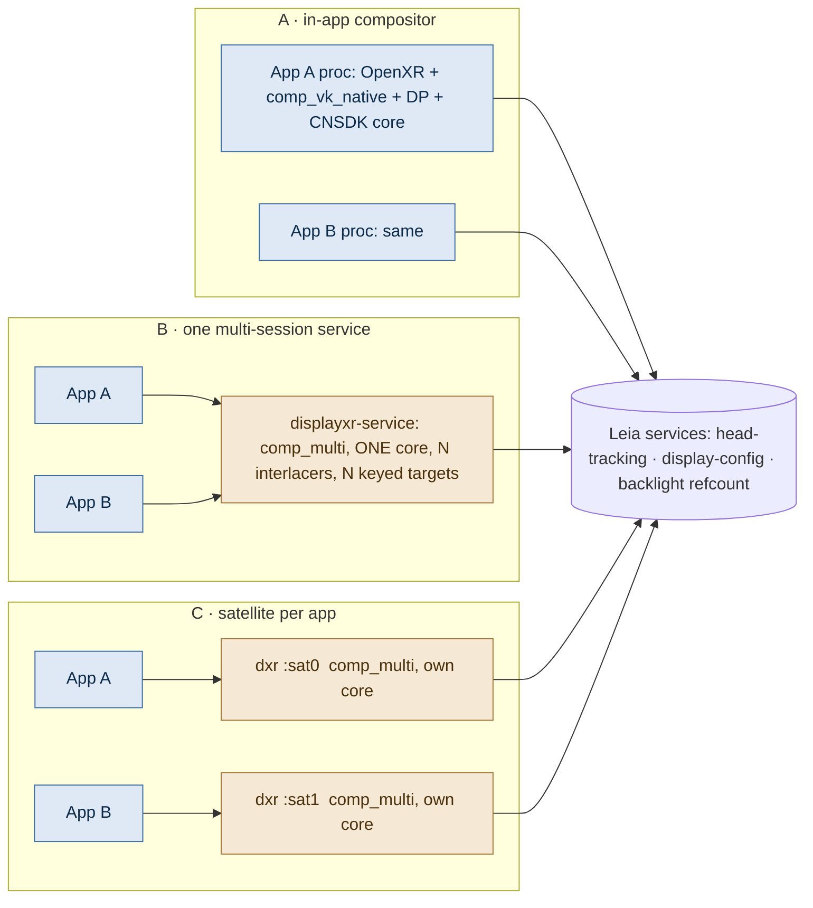
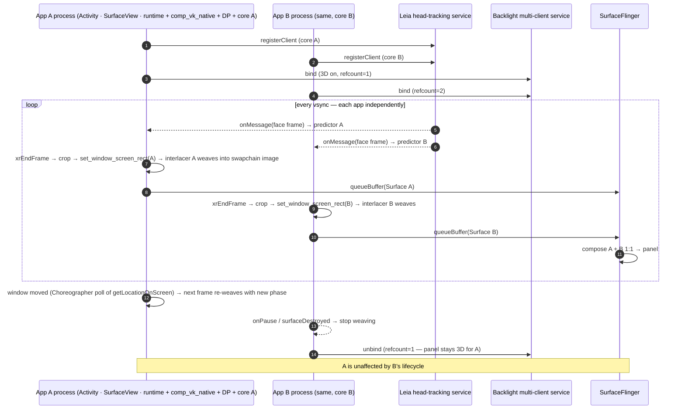

# Concurrent multi-app DisplayXR on Android — architecture report

**Question.** Can N DisplayXR apps on one Android device (phone, tablet, freeform/desktop windowing, external panels) each render into its own Surface and all be **woven and presented concurrently** — the way N in-process apps behave on Windows today — and what architecture gets us there, including a port of `displayxr-browser`?

**Legend.** 🟢 **PROVEN** — read in code (file:line given). 🟦 **PLATFORM** — Android semantics (AOSP/dev-docs cited). 🟠 **LEIA** — CNSDK / LeiaSR behaviour, proven in their source unless marked. ⚪ **ASSUMED** — not verified. 🔷 **RECOMMENDATION.**

## 0. Findings in one page

| # | Finding | Class |
|---|---|---|
| F1 | Windows in-process isolation is total: **1 session → 1 compositor → 1 DP → 1 SR weaver → 1 SRContext**, no cross-process primitive at all; the only shared thing is the SR service (tracker, calibration, lens) reached over IPC by every process. | 🟢 |
| F2 | The Windows service's "one actively woven client" is **not an IPC property**: layer commit runs outside `global_state.lock`, every client keeps rendering; the exclusivity is the **one-DP-per-panel policy** (ADR-035 D3) built on three 🟠 Leia-SR facts — one weaver per HWND *ever*, phase read from the weaver's own HWND each frame, lens hints OR-ed across SRContexts with no arbitration. | 🟢/🟠 |
| F3 | Android's one-visible-app behaviour is an **inherited Monado singleton**: `android_globals` holds ONE unkeyed `ANativeWindow`, `passAppSurface(Surface)` carries no client id, `clearAppSurface()` clears it for everyone. `comp_multi` already renders **every** client, every frame, into its own target with its own DP — the multi-session loop exists; the surface plumbing doesn't. | 🟢 |
| F4 | Android runs the compositor out-of-process by **policy** (ADR-025: manifest package-visibility + ADR-019 vendor isolation), not necessity. The in-process flavor still builds, is the *only* flavor CI builds, and rendered head-tracked Leia 3D in-process (M7/#499/#507). The Khronos Android loader `dlopen`s the runtime into the app process by design; an OOP service is the runtime's private choice. | 🟢/🟦 |
| F5 | **LeiaSR/CNSDK being Android services does *not* require the DisplayXR compositor to be a service.** CNSDK's head-tracking service is genuinely multi-client (client map, broadcast to all, `any_of`/`max` aggregation, no cap); the camera is opened once by that service; the backlight service is binder-refcounted across processes. N processes each holding a CNSDK core is what those services were built for. | 🟠 |
| F6 | The multi-window primitive already exists in CNSDK: **one core drives N interlacers**, each with its own **on-panel phase origin** (`leia_interlacer_set_viewport_screen_position`) and caller-supplied framebuffer; the shipping `sdk-test` sample runs 7 interlacers in one Activity. LeiaSR (Windows) *lacks* this setter — phase always comes from the HWND. | 🟠 |
| F7 | **N CNSDK cores in one process is not viable** (Java singleton + `g_platform`/service globals). Today's Android service creates a *new core per client session* — two concurrent Android clients would already collide inside the vendor plug-in, independent of the surface singleton. | 🟠 |
| F8 | Genuine 🟠 Leia gaps for any concurrent design: (a) head-tracking *config* is service-global last-writer-wins; (b) `BacklightMultiClientControlService` is a binary bind-refcount (a bound client cannot say "I'm 2D right now"); (c) neither CNSDK nor LeiaSR knows more than one physical display; (d) vendor services are only discoverable by package name. | 🟠 |
| F9 | 🟦 Every pixel-exactness rule (no `setFixedSize`, swapchain extent == surface extent, no size-compat scaling, honour the buffer-transform hint, SurfaceView not TextureView, no wide-gamut) is **architecture-neutral**. The one Android-specific hazard is **window move**: a pure move raises no resize, only a `oneway IWindow.moved`, and SurfaceFlinger repositions the layer with the old buffer — weave phase goes stale during a drag unless the compositor re-weaves from a polled `getLocationOnScreen()`. | 🟦 |
| F10 | The roadmap item **#967d (D-4) plans the opposite shape** for Android — a service-owned fullscreen shared surface with one DP compositing N clients. That is a *workspace overlay*, not per-app Surfaces under SurfaceFlinger; it should become an optional shell mode, not the default. | 🟢 |
| F11 | `displayxr-browser` needs `XR_DXR_weave` on Android; it is compiled only for Win32/macOS today, but the IPC wire is already handle-polymorphic (AHardwareBuffer + fd) and `comp_multi_weave_macos.c` is the template. The browser's weave client is small; the risk is Chromium's GPU-process ↔ runtime connection. | 🟢 |

🔷 **Recommendation (§9).** Adopt one runtime abstraction — **a compositor instance per window, sharing only per-display vendor services** — and realise it on Android as **Architecture A (in-app compositor + CNSDK core, IPC only to the Leia services)**. Its two blockers are packaging, not rendering: a vendor-neutral package-visibility convention (a CNSDK/firmware manifest change, in scope) and runtime-hosted vendor Java glue. Keep **Architecture C (one satellite compositor process per app)** as the same abstraction's *out-of-process deployment* — the cheapest way to prove N cores in N processes on hardware, the fallback if the vendor convention stalls, and the right host for `displayxr-browser` (no vendor code inside Chromium). Reject **B (one multi-session service)** as the primary because it is more runtime work *and* weaker isolation; its shared-surface variant (#967d) survives only as an optional shell/workspace mode.

---

## 1. Windows in-process architecture (the reference behaviour) 🟢

**Compositor.** `xrCreateSession` (D3D11) → `oxr_session_populate_d3d11_native()` (`src/xrt/state_trackers/oxr/oxr_session_gfx_d3d11_native.c:124-197`) → `comp_d3d11_compositor_create(...)` (`:147-149`), one `new comp_d3d11_compositor()` per session (`compositor/d3d11/comp_d3d11_compositor.cpp:2861`), on the **app's** device (`:2913-2917`, ADR-001). Window branches at `:2876-2910` (`_texture` → `hwnd=nullptr`/`app_hwnd`; `_handle` → app HWND; `_hosted` → runtime-created window). Same shape for d3d12/gl/vk_native (`oxr_session.c:438-471`).

**Per-process vs per-instance.** `comp_d3d11_compositor.cpp` has no file-scope mutable statics. Per-process statics exist only in `comp_d3d11_target.cpp:36-102` (late-weave governor, frame-latency waitable, watchdog — "one target per process") and the plug-in loader (`target_plugin_loader.c:49-70`). Two *sessions in one process* would share those; two *apps* never do.

**DP.** Vendor DLL loaded once per process at first `target_plugin_get_active()` (`target_plugin_loader.c:1947-1968`); `leia_plugin.c:321-376` is a static, stateless iface (`:109-115`). A DP instance is created **per compositor**, bound to that compositor's device + HWND: `factory(c->device, c->context, dp_hwnd, &c->display_processor)` (`comp_d3d11_compositor.cpp:3156-3161`) → `leia_display_processor_d3d11.cpp:2076-2116` creates its own weaver → `leia_sr_d3d11.cpp:122-290`: `SR::SRContext::create()` per weaver (a client connection to the SR service; retried on `ServerNotAvailableException`) + `SR::CreateDX11Weaver(ctx, d3d11ctx, hwnd)` (`:271`). **1 session = 1 compositor = 1 DP = 1 weaver = 1 SRContext** (+1 hidden probe weaver for runtime-owned-window snapping, `:546-632`).

**Weave ↔ window.** `process_atlas` sets the viewport from the canvas rect (`leia_display_processor_d3d11.cpp:1237-1289`); the SR weaver reads that viewport plus its HWND's screen rect every frame → `xOffset = window_WeavingX + vpX`, phase = `(x + slant·y)/pitch` (leia-plugin `docs/weaver.md:199-228`; LeiaSR `dx11weaver.cpp:1076-1092,1246`). Phase snapping is done *inside* the SR weaver by subclassing the HWND (`docs/window-phase-snapping.md`; LeiaSR `WeaverBaseImpl.ipp:214-390`), which ADR-033 blesses. `set_window` (slot 20, #1008) exists only for the service (`comp_d3d11_service.cpp:8772`). Kooima is canvas-scoped per session (`comp_d3d11_compositor.cpp:5109-5140`).

**Tracking/calibration.** Each DP's own weaver → `getPredictedEyePositions()` (`leia_sr_d3d11.cpp:739-766`); predictor per session by design (`:999-1004`; LeiaSR: predictor is app-side, per weaver, with its own latency, `dx11weaver.cpp:1227-1233`). No static SR context/tracker/mode in the plug-in.

**Scheduling.** Per-compositor DXGI flip chain (`comp_d3d11_target.cpp:339-354`), `Present(1)+SetMaximumFrameLatency(1)` (`comp_d3d11_compositor.cpp:720-724`), late weave, per-compositor repaint thread (`:2076-2178`, `:3144`). **No cross-process synchronisation primitive exists.**

**Why N apps don't interfere.** Separate process (DLL images, loader globals, pacing statics), device, DP+weaver+SRContext, swapchain+present loop, HWND (→ phase). Shared: SR service tracker/camera/calibration/display config, and DWM. Known limit: the lens is display-global and in-process has **no runtime arbiter** — each session pushes `lens_hint enable/disable` (`leia_sr_d3d11.cpp:1113-1131`) and SRService OR-refcounts per-client preferences (LeiaSR `server.cpp:258-274`, `lensswitchbehavior.cpp:128-171` 🟠); ADR-028 keeps content geometry independent of that state.

## 2. Windows IPC architecture 🟢

One `displayxr-service.exe`: one D3D11 device (`comp_d3d11_service.cpp:18528`, `:18546`); threads = IPC main (20 Hz), **N per-client IPC threads** (`ipc_server_process.c:1029` — every handler incl. `layer_commit`, `weave_submit`), **ONE render thread** (`:7242`), a window thread per window (service window + one per hosted client since #1014, `:4529`). Locks: `render_mutex` (panel lock), per-client `c->mutex`, `global_state.lock`, `atlas_submit_mutex` (#1018).

Presenter kinds `SERVICE_WINDOW / APP_HWND / CLIENT_TEXTURE / SELF` (`:1838-1855`) fixed at session create (`:4585`); slots `mc->clients[24]` (`:1742`); `mc->focused_slot` = single focus authority (`pipeline_pick_focus :9339`); the **panel lease** (`client_holds_panel_lease :3033`, #961) = single mode owner. **Exactly one DP per panel** (`pipeline_bind_panel_dp :8719` re-binds; graveyard `:8417`). Leia DP/weaver only in the service.

Three presentation models in `multi_compositor_render` (`:10139`): (a) **workspace compose** — every placed client's atlas blitted into `combined_atlas`, **one** `process_atlas` (`:12584`), one Present; all clients render, all VISIBLE, one FOCUSED (`ipc_server_process.c:887-893`); (b) **default presenter policy** (`:9588`) — one presenter/frame; others keep rendering (`:15877`) paced by #1019 backpressure; non-focused `APP_HWND` clients get a DP-free `pipeline_flat_present` (`:9092`); the outgoing window is parked (`:9560`); (c) **present-owner / client-texture** (`:9746`) — `pipe_owns_panel` mutual exclusion (`:9645-9652`, `:13681`).

The #954–#1026 series made *coexistence* robust: client classes/quotas (#960), one focus authority (#962), panel lease (#961), one pipeline (#964), foreground-by-process + park/unpark (#1014/#1017), atlas atomicity (#1018), DP re-bind in place (#1008/#1021), commit backpressure (#1019).

## 3. Why Windows IPC has N clients but ONE actively woven client

| Cause | Anchor | Class |
|---|---|---|
| One DP per panel by design (ADR-035 D3/D-4); `panel_dp()` for every writer | `comp_d3d11_service.cpp:2534, :8719` | POLICY (chosen to fix the next two) |
| N DPs ⇒ N SRContexts ⇒ N lens hints OR-ed by the SDK, no cross-DP arbitration; a retiring DP must drop its vote first | `:8422`; `service-one-pipeline.md` §1 | 🟠 LEIA-SR |
| **One DP per HWND, ever** — SR subclasses the weaver's HWND; two live weavers on one window recurse the subclass chain (2474-frame stack, monkey r3) | `:8463-8487` | 🟠 LEIA-SR |
| Weaver takes phase + size from its created-against window (`Window2::getScreenRect` per frame) ⇒ re-bind on presenter change (destroy/recreate ~200 ms, or slot-20 `set_window`) | `xrt_display_processor_d3d11.h:411-435`; `:8770-8783` | 🟠 LEIA-SR (mitigated) |
| Shared-DP state re-asserted at every `process_atlas` site (#1016) | `:9873`, `:12570`, `:17264` | STRUCTURAL consequence |
| ONE render thread; must never make an unbounded driver call for one client (#1017 NVIDIA hang) | `:7242`, `:9750-9765` | STRUCTURAL |
| One immediate context — `weave_submit` serialises on `render_mutex` | `:17232-17237` | STRUCTURAL (single device) |
| Panel lease = one mode owner; non-holders denied | `:3033`, `:13570-13590` | POLICY (#961) |
| Mode/geometry are process-global scalars pushed to every client's shm | `ipc_server_process.c:685-693` | HW lens display-global 🟠; content grid runtime choice |
| One qwerty ticker; Kooima follows the presenter's rect; late-weave governor samples only while the service window presents | `:9499`; `59d701ed4`; `:7325-7333` | POLICY |
| Pacing follows the active presenter's waitable | `:7270-7292`, `:10014-10040` | STRUCTURAL (one loop, one clock) |
| Cross-process `Present(1)` on an occluded foreign window throttles to DWM's drain (138–626 ms) | `:8884`, `:9100-9110` | STRUCTURAL (DWM) |

**Does IPC serialise anything? No.** `ipc_handle_compositor_layer_sync` calls `xrt_comp_layer_commit` *outside* `global_state.lock` (`ipc_server_handler.c:3443-3454`); the compositor never takes it; per-client RPC serialises only within one client (`proto.py:68-131`). Capacity is not the limit (`IPC_MAX_CLIENTS 32`, `D3D11_MULTI_MAX_CLIENTS 24`, PRESENT_OWNER quota 2, `ipc_server_handler.c:149-157`). Visibility is explicitly *not* the mechanism.

**All-concurrent designs existed twice.** `DXR_LEGACY_STANDALONE=1` (`:2534`): per-client window + swapchain + **own DP** presenting on the IPC thread — failure modes (N DPs on one panel ⇒ SR recalibration + lens fights, `compositor_hwnd` pinned, `active_compositor` last-writer) are why one-pipeline exists. And `comp_multi`'s `render_per_session_clients_locked` (`comp_multi_system.c:5190`) iterates **all** clients per loop with own target + own DP — the shape Android runs.

**Verdict.** Hard blockers are 🟠 *per-HWND weaver identity* and *un-arbitrated global lens state*; the one-presenter rule is a runtime policy on top. Nothing forbids one SRContext per **process** — the legacy path ran N; the prohibition is *arbitration*, not *instantiation*. (Loose end: local leia-plugin checkout v2.1.2 vs pinned v2.3.0 — slot-20 `set_window` isn't in the local tree.)

## 4. Current Android architecture 🟢

**Flavors.** `openxr_android/build.gradle:352-372`: `inProcess` (`XRT_FEATURE_SERVICE=OFF`) and `outOfProcess` (`=ON`, adds `:src:xrt:ipc` `:400` and the CNSDK Java-glue AAR `:421-424`). **CI builds only `assembleInProcessDebug`** (`build-android.yml:137`). In-process is intact: `comp_vk_native_target.cpp` Android backend (`:128-132`, `:1337-1360`, surface re-sync `:1649-1730`); runtime self-spawned SurfaceView when no window is bound (`oxr_session_gfx_vk_native.c:274-300`, "single-app POC"); plug-in loaded into the app via `target_plugin_loader.c` Android branch (`:983-1123`). No `XR_DXR_android_surface_binding` spec file exists (display_info.md §4 "planned").

**OOP shape.** `libdisplayxr-service.so` = null compositor + `comp_multi`. `multi_main_loop` (`comp_multi_system.c:5689-5810`) → `render_per_session_clients_locked` (`:5190-5272`) iterates **all** clients → `render_session_to_own_target`: per-client `comp_target` (`comp_window_android.c`), per-client DP via `dp_factory_vk` marshalled to the service main Looper (`comp_multi_compositor.c:1863-1892`), cached across end/begin (leia-plugin#39), `set_target_color_view` + `process_atlas` per session (`comp_multi_system.c:3312-3340`), present per target; deferred weave fence (`:124`, `:3461`, #663). One `vk_bundle`, one queue (`:5194`, `:5150`, `:3484`), per-client cmd pool/fences. Per-target pacing (`u_pc_fake` + per-target AChoreographer thread, `comp_target_swapchain.c:655-708`). Eye poses per-session DP (`comp_multi_compositor.c:1954-1960`). Server-side Kooima per client, rebased to that client's window rect on **both** Android (#1034) and macOS (`ipc_try_get_oop_view_poses`) — display-scoped only until the client's first window rect arrives. Transport: binder bootstrap → socketpair fd (`Client.java:203-225`, `service_target.cpp:163-175`, `ipc_server_mainloop_android.c:43-108`); discovery via `org.khronos.openxr.runtime_broker`. VISIBLE is non-exclusive (`ipc_server_process.c:880-921`); no active/focused selection exists on Android.

**The singleton that serialises everything.**

| Item | State | Anchor |
|---|---|---|
| `android_globals` window | ONE, unkeyed; `store_window` overwrites + bumps generation | `android_globals.cpp:21-44, 74-97` |
| `passAppSurface(Surface)` | no client id; JNI `ANativeWindow_fromSurface` + global overwrite ⇒ last writer wins | `IMonado.aidl:24`; `MonadoImpl.java:98-105`; `service_target.cpp:177-187`; `@todo client ID` `MonadoImpl.java:200,251` |
| `clearAppSurface()` | invalidates the global for every client | `IMonado.aidl:37`; `service_target.cpp:299-310` |
| `comp_window_android_create(c)` | no id; polls the global; N sessions ⇒ N `vkCreateAndroidSurfaceKHR` on one window | `comp_window_android.c:179, 126-169` |
| `android_surface_sync` (#528) | any client's surface change tears every target down | `comp_target_swapchain.c:1088-1131` |
| `android_window_valid_state` (#563) | one int; transition pauses/resumes **every** DP | `comp_multi_private.h:731`; `comp_multi_system.c:5642-5685` |
| service overlay + `overlay_mode` | single `custom_surface` slot; process-wide atomic set by the *last* connecting client | `service_target.cpp:189-253`; `android_globals.cpp:42,124-136,159-171`; `MonadoImpl.java:112-162` |
| DP factory `window_handle` | NULL ⇒ the DP cannot tell clients apart | `comp_multi_compositor.c:1877` |

`docs/architecture/service-architecture.md:517`: *"clients on screen … 1 — the app surface is a process-global singleton."*

## 5. The exact reason Android uses OOP/IPC 🟢

ADR-025 (quoted): *"Under Android 11+ package visibility, the calling process's manifest must declare `<queries>` for any package it binds or queries. Since the SDK runs in the app's process, it is the app's manifest that must carry those `<queries>` … An SDK-free app aborts the moment the SDK calls `GetPackageInfo` on the vendor service package."* Weighted reasons: only model satisfying ADR-019 on Android (temporal + combinatorial coupling otherwise); matches Windows; proven XR topology; cheap. Decision: *"vendor display processors run out-of-process, in the DisplayXR runtime service. In-process is a development/bring-up flavor only."* 2026-08-16 amendment: the DP is `dlopen`ed into the service; no DP proxy exists anywhere.

**The two requirements are different:**
- **A. "LeiaSR must be out-of-process"** — true for camera/tracking/calibration/lens: they *are* separate device services; 🟦 camera2 is exclusive by `(oom_adj, procstate)` and background access needs an FGS of type `camera`, so a single owner fanning poses out is forced on any architecture; the head-tracking service is exactly that (`foregroundServiceType="camera"`, CNSDK manifest `:41-52` 🟠). CNSDK's core-impl `.so` is loaded from the vendor APK into whichever process hosts the core (`loader.service.cpp:48-119` 🟠).
- **B. "The DisplayXR compositor must be out-of-process"** — **false as a technical matter.** The service manifest carries exactly the `<queries>` an in-process app would need (`openxr_android/src/main/AndroidManifest.xml:52-66`); in-process rendering with the vendor DP was validated (M7/#499/#507); the Khronos loader model is in-process (🟦 runtime.adoc: broker returns `native_lib_dir`/`so_filename`, "the loader should attempt to use `dlopen`"). What OOP buys is *packaging*: no vendor manifest entries, Java glue or `.so` in the app.

Android-OOP is a **vendor-isolation policy derived from a real 🟦 manifest rule**, not a rendering constraint — and F3/F7 show it was never generalised beyond one client.

## 6. Is an in-process Android compositor talking to LeiaSR/CNSDK over IPC feasible?

**Yes.**

| Concern | Status | Evidence / what it takes |
|---|---|---|
| Binder to vendor services from an app | 🟦 needs visibility | `<queries>` matching by **intent action** grants *package-level* visibility (developer.android.com/training/package-visibility/declaring). Vendor-neutral convention: vendor services advertise `<intent-filter><action android:name="org.displayxr.action.VENDOR_DISPLAY_SERVICE"/>`; a `displayxr` AAR manifest declares one `<queries><intent>` for that action ⇒ no temporal/combinatorial coupling. **Requires a CNSDK/firmware manifest change** (in scope). ⚪ verify explicit-component `bindService` after intent-query visibility on a retail device. |
| Camera / tracking | 🟠 fine | Owned by `com.leia.headtrackingservice`; multi-client broadcast (`server.hpp:86-91`, `binderServer.cpp:84-109,152-166`); no CAMERA permission for the in-service runtime (`leia_cnsdk.cpp:636-638`). |
| Vulkan/EGL ownership | 🟢/🟠 fine | Compositor uses the app's device (`comp_vk_native`); interlacer takes the caller's `VkDevice`, renders into a caller `VkFramebuffer` (`interlacer.vulkan.h:53-88`), pinned to its init thread only. |
| Surface / `ANativeWindow` | 🟢 fine | App-owned SurfaceView → `vkCreateAndroidSurfaceKHR` (`comp_vk_native_target.cpp:1337-1360`); no cross-process handoff. |
| CNSDK host requirements | 🟠 manageable | main Looper must pump (`LeiaSDK.java:376`) → marshal DP creation onto the app main thread (`aux_android/android_main_thread` exists; must be **async** if `xrCreateSession` runs on the main thread); Context with `getApplication()` (Activity ok); Activity-only calls already gated (`leia_cnsdk.cpp:589-618`). |
| CNSDK Java glue in the app classloader | ⚪ | Core-impl load goes through `com.leia.sdk.internal.Plugin`/`com.leia.core.Loader` (sdk AAR); the runtime must host that glue as it hosts `org.freedesktop.monado.ipc.Client` (`loadClassFromRuntimeApk`, `ipc_client_android.cpp:54-58`) — e.g. a ContextWrapper over the Activity whose `getClassLoader()` is the runtime APK's. Spike. |
| Process-global vendor state | 🟠 | One core per process (`core.h:39,84`; `LeiaSDK.java:388`; `androidDevice.cpp:83-95`) — fine in-app (one app = one core = the Windows one-SRContext-per-DP shape). HT config global last-writer (`server.cpp:126-267`) — CNSDK fix, or the runtime never writes config. |
| Backlight arbitration | 🟠 fine | `BacklightMultiClientControlService` bind=on / last-unbind=off (`.kt:48-103`) — refcounted across processes by binder; plug-in must use that path only (legacy `BacklightControlService` forces 2D on unbind, `.kt:40-45`). |
| Freezer / lifecycle | 🟦 best case | The compositor *is* the foreground app; no bound-service edge. |
| Failure domain | ⚪ | Vendor crash/hang inside the app (leia-plugin#39 join-hang at core release) — the risk Windows apps accept; `_exit` on teardown. |
| Browser | 🟢 risk | Runtime + vendor plug-in `dlopen`ed inside Chromium's GPU process (cross-APK linker namespace, seccomp) — the one place A is the wrong host (§7). |

**Answer:** *LeiaSR being an Android service does not require the DisplayXR compositor to be a service.* What must be solved is manifest visibility + Java-glue hosting — packaging, not rendering.

## 6b. Android platform constraints that shape every option 🟦

Cited from AOSP/dev-docs by the platform survey; **[A]** marks inference.

- **Surface passing is first-class.** `Surface` is Parcelable and carries producer *and* `surfaceControlHandle` (`android_view_Surface.cpp`); a producer in another process is the standard SurfaceView pattern (source.android.com/docs/core/graphics/arch-bq-gralloc; Car App Library precedent). One producer per BufferQueue (`BufferQueueProducer::connect` → `BAD_VALUE "already connected"`); a `lockCanvas()` on the SurfaceView poisons it for GL/VK forever (arch-sh) — **the app must never draw on its own SurfaceView**. `surfaceDestroyed` must block until the producer detaches (SurfaceHolder.java); an abandoned queue fails fast with `NO_INIT`. `ASurfaceControl_createFromWindow` (API 29) lets a remote process create a child layer with explicit crop/position/scale — a way to *prove* 1:1.
- **SurfaceFlinger does not throttle occluded/background layers** (`latchBuffers` gates on `hasReadyFrame` only); visibility only affects refresh-rate voting. N surfaces from one process are fine; the only per-process serialisation is a shared `VkQueue` **[A]**.
- **Pixel exactness (arch-neutral, all Critical/High):** never `SurfaceHolder.setFixedSize` (SurfaceView scales `mScreenRect/mSurfaceWidth`); swapchain `imageExtent` must equal `currentExtent` or presentation scales; server-side compat scaling is invisible to the client (`WindowState.mGlobalScale = mCompatScale*mOverrideScale`: size-compat/letterbox for non-resizable or fixed-aspect activities, `DOWNSCALED` overrides) → declare resizable, no fixed orientation/aspect, current targetSdk; honour `AttachedSurfaceControl.getBufferTransformHint()` (API 31) or the composer rotates the buffer; avoid wide-gamut/HDR dataspaces **[A]**; SurfaceView, never TextureView (arch-tv); translucent UI over a Z-below SurfaceView is alpha-blended over the weave **[A]**. Desktop windowing is GA in Android 16 QPR3 *with* "compatibility treatments to scale windows" — the compat-scaling row is not theoretical.
- **The window-move finding.** A pure move (no size change) produces **no `IWindow.resized`** (`WindowFrames.didFrameSizeChange` compares w/h only); it goes `WindowState.handleWindowMovedIfNeeded → oneway IWindow.moved`; on the client `MSG_WINDOW_MOVED → maybeHandleWindowMove` only updates `mAttachInfo.mWindowLeft/Top` — no layout, no invalidate, no public callback; `SurfaceView` derives `positionChanged` from `getLocationInWindow()` (unchanged). **SurfaceFlinger repositions the layer with the old buffer** ⇒ stale interlace phase for the whole drag. Mitigation **[A]**: poll `View.getLocationOnScreen()` from a `Choreographer` callback and re-weave on change (≥1 frame of wrong phase; move and buffer are not atomically synchronised except in BLAST drag-*resize*). Trap: OEM `OVERRIDE_SANDBOX_VIEW_BOUNDS_APIS` makes `getLocationOnScreen` window-relative — opt out with `PROPERTY_COMPAT_ALLOW_SANDBOXING_VIEW_BOUNDS_APIS=false`. (Windows' answer is weaver-side phase snapping via WndProc; Android has no snap hook.)
- **BLAST (Android 12+):** the `BLASTBufferQueue` consumer runs **in the app process** — even with an OOP compositor the app process is on the per-frame critical path.
- **Freezer / FGS.** Frozen iff `curAdj >= 900` (`CACHED_APP_MIN_ADJ`), 10 s debounce; a bound service inherits its client's importance (`computeServiceHostOomAdjLSP`), so bind with `BIND_AUTO_CREATE|BIND_IMPORTANT|BIND_ABOVE_CLIENT` (`Client.java:271-278` already does); a **sync binder into a frozen process kills it** — drop IBinders on unbind. FGS type mandatory (A14); `specialUse` is the only honest type for an always-on compositor; Android 15 narrows the `SYSTEM_ALERT_WINDOW` background-start exemption to a *visible* overlay — hits the runtime's service-overlay path (`service_target.cpp:189-253`).
- **Multi-display.** `DisplayManager`/`Presentation`/`setLaunchDisplayId` give per-display windows; `VK_KHR_android_surface` has no display concept, so a secondary-display Surface works identically **[A]**; `VirtualDisplay` is a poor weave target (re-composited).
- **Cross-process GPU.** `HardwareBuffer` is Parcelable, zero-copy; VK import needs `vkGetAndroidHardwareBufferPropertiesANDROID` + dedicated allocation; `SYNC_FD` semaphores/fences are temporary-import only (binary, re-imported every frame; no timeline); `VkDevice` is process-local. GPU context slots are firmware-bounded (Mali `MAX_CSGS 31`, Adreno `MSM_GPU_MAX_RINGS 4`); use `VK_KHR_global_priority`, degrade on `NOT_PERMITTED` **[A]**.
- **Binder.** 1 MB shared buffer (oneway gets ½), 15+1 threads, ~70 µs sync RTT ≤1 KB (VTS) — window position per frame is a small oneway; poses belong in `SharedMemory`.
- **Process-per-app.** `isolatedProcess` cannot reach SurfaceFlinger/gralloc (sepolicy `isolated_app_all.te`) and `bindIsolatedService`/`externalService` are isolated — a satellite must be a **pre-declared, non-isolated `android:process`** slot; N slots are static (Chrome's `SandboxedProcessService0..N` precedent).

## 7. Candidate architectures

All share the **same runtime abstraction** (§13): a compositor *instance* per window/session (swapchains, target, DP/interlacer, phase origin, timing, fences, visibility) over *vendor services* per physical display (camera, tracker, calibration, lens state).



**A — in-process compositor + IPC to vendor services.** Each app process: session, `comp_vk_native`, swapchains, DP (`libdxrp050_leia_cnsdk.so` + one CNSDK core), own SurfaceView, own interlacer with own phase origin. The Windows shape and the loader's native shape. Feasibility §6. Needs: vendor-neutral visibility convention (or ADR-025's coupling), plug-in Java-glue hosting, `XR_DXR_android_surface_binding` for real, per-window origin feed, CNSDK config hygiene.

**B — one OOP multi-session compositor.** Generalise `libdisplayxr-service.so`: keyed surfaces (`passAppSurface(Surface, clientId)`), keyed `android_globals`, key threaded into `session_render` → `create_from_window(external_window_handle=key)` → per-client `comp_window_android`, per-client transition/pause, per-client overlay policy, real watchdog; **one CNSDK core per process with one interlacer per client** (plug-in refactor — today `leia_dp_factory_cnsdk` mints a new core per DP, `leia_display_processor_cnsdk.cpp:1520-1573`); per-window phase origin from client-reported metrics; #967b/c bounded waits + GPU work outside `list_and_timing_lock`; foreground-service/freezer hardening. Rendering N app-owned Surfaces at every refresh from one service is possible (🟦 §6b; `render_per_session_clients_locked` already loops all clients).

**C — one compositor process per app (satellite).** K pre-declared `MonadoServiceSlot0..K-1` with `android:process=":dxrN"`; the main runtime service (broker) hands a free slot to each client; each satellite runs **today's OOP code unchanged** for one client (comp_multi + null + one `android_globals` window + one DP + one core). Isolation by process; backlight refcount and multi-client tracking come from the vendor services. Needs the same per-window origin feed as A/B, plus slot brokerage and lifecycle (bound `BIND_IMPORTANT|BIND_ABOVE_CLIENT` → inherits its app's importance; exits on unbind). Cost: ~30–60 MB + one GPU context per app, static slot count.

**(B′) shared-surface workspace overlay (#967d D-4).** Service-owned fullscreen surface, one DP, N clients composited at workspace poses (macOS `render_shared_surface_locked` shape). One runtime-owned window per display — a spatial-desktop overlay, wrong as the default when the OS is the window manager, legitimate as a shell/kiosk *mode*.

## 8. Pros / cons / risks

| Criterion | A · in-app | B · one service | C · satellite per app |
|---|---|---|---|
| Concurrent weave of all visible apps | ✅ | ✅ after keyed-surface + one-core/N-interlacer work | ✅ with today's code × N |
| Non-interference (stall/crash/GPU) | ✅ process isolation | ⚠️ one render thread + one queue (#967b/c needed); single failure domain | ✅ process isolation |
| Freezer / lifecycle 🟦 | ✅ immune (is the foreground app) | ⚠️ bind-propagation + `specialUse` FGS; unbind edge | ⚠️ same, ×N; a cached app's satellite freezes *with* it (desired) |
| Window-move phase (🟦 F9) | poll in-app, no hop | app must forward per frame (oneway ~70 µs) | same as B |
| Fidelity to Windows in-process | ✅ identical | ❌ central | ✅ same model, boundary one process out |
| Vendor isolation (ADR-019/025) | ⚠️ needs vendor-neutral `<queries>` convention + glue hosting | ✅ | ✅ |
| Runtime engineering | medium: real `XR_DXR_android_surface_binding`, async main-thread marshalling, classloader hosting | high: keyed globals, plug-in shared-core refactor, lock/bounded-wait work, per-client policy | low–medium: slot broker + manifest, lifecycle, origin feed |
| Vendor changes | L1 config, L7 intent filters | plug-in one core/N interlacers | L1 |
| Memory / processes | one core per app (as Windows) | ✅ lowest | one core + one process per app (highest) |
| Latency | ✅ no hop; loader-native | one hop, zero-copy AHB | one hop, zero-copy AHB |
| Browser | ❌ vendor code inside Chromium GPU process | ✅ weave service in the shared service | ✅ weave service in the browser's satellite |
| Multi-display | per instance display id — vendor gap either way (L6) | central | per instance |
| Untested vendor path | N cores in N processes (designed for, never exercised) | one core/N interlacers (shipping `sdk-test`) | same as A |
| Key risk | vendor cooperation on manifests; Chromium | HOL blocking; freezer; #967d pulls the other way; L4 | static slots; per-process cores unproven on HW |

## 9. Recommended architecture 🔷

**Target: Architecture A — the in-app compositor — realising "one compositor instance per window; shared vendor services per display."** It is the Windows model verbatim, the Khronos loader's native shape, freezer-immune, hop-free for the per-frame window origin, and it needs no runtime-side arbitration because the OS is the window manager and the vendor services already arbitrate what is genuinely display-global (tracker multi-client, backlight refcount). Its blockers are two packaging items — a vendor-neutral package-visibility convention (a CNSDK/firmware manifest change, in scope) and runtime-hosted vendor Java glue — plus CNSDK hygiene (L1/L2).

**Keep Architecture C as the out-of-process deployment of the same abstraction**, for three jobs: (1) PoC-0 — the cheapest hardware proof that N CNSDK cores in N processes weave concurrently (this is A's real unknown too, and C tests it with today's code); (2) fallback if the vendor visibility convention stalls (C keeps ADR-025 intact); (3) the browser host — Chromium's GPU process should reach a satellite over the runtime IPC rather than `dlopen` vendor code.

**Do not pursue B as the primary.** More runtime work and weaker isolation than either; its only structural wins (one core, lowest memory) don't outweigh HOL blocking and single-failure-domain on a device whose OS already composites windows. **Re-scope #967d**: keep D-1/D-2/D-3 (they help every path); D-4/D-5 become an optional *workspace overlay mode*, and a new sub-issue owns the per-window path (§10).

The abstraction is shared, so ~80% of the runtime work (window-origin feed + DP slot, per-window Kooima, backlight-refcount hygiene, `XR_DXR_weave` on Android, surface-binding extension) is common to A and C.

## 10. Specific code changes / refactors

**Common (A and C):**
1. **Window-origin feed + DP slot.** New append-only DP vtable slot `set_window_screen_rect(x,y,w,h,display_id)` (ADR-020); leia plug-in maps it to `leia_interlacer_set_viewport_screen_position` + `set_viewport` (`leia_cnsdk.cpp:1191-1224` already sets both per frame; drop the reset-to-(0,0) on full-target frames). Client side: sample `View.getLocationOnScreen()` (opt out of view-bounds sandboxing) in a `Choreographer` callback; in A call the compositor directly, in C forward over the existing window-metrics IPC channel (`multi_compositor_get_window_metrics`, `comp_multi_compositor.c:2076-2090`).
2. **Per-window Kooima — DONE for OOP Android (#1034).** `ipc_try_get_oop_view_poses` now rebases the Kooima to the session's own window on Android as well as macOS: canvas = the window's metres (rect px x the panel's square-pixel pitch), render eyes re-expressed relative to the window centre, sourced from the #1033 rect cached on `session_render` (`multi_compositor_get_window_screen_rect`). The client publishes the panel extent in the CURRENT rotation alongside the rect, because the runtime's display info is the NATURAL-orientation panel and a sub-panel window fits inside both orderings. No rect yet -> display-scoped, exactly as before. Still open: the in-process (Architecture A) equivalent in `comp_vk_native`, from its own window metrics.
3. **Backlight hygiene:** confirm the plug-in resolves to `BacklightMultiClientControlService` (`androidDevice.cpp:809-859` tier 1); make `on_pause` release (unbind) rather than force-2D globally (`leia_cnsdk.cpp:781-800`, `:684-688`).
4. **`XR_DXR_weave` on Android:** `comp_multi_weave_android.c` from `comp_multi_weave_macos.c` (gated `:65`, CMake `:304-308`); un-gate `oxr_extension_support.h:683`; header: handle-kind enum, acquire/release `sync_file` fd, `xrWeaveBindWindowDXR` takes explicit origin+size (not an HWND; the service does `GetClientRect` today, `comp_d3d11_service.cpp:17298`), adopt v6 `XrWeaveSubmitLayoutDXR`. Wire already carries AHB + fd (`proto.json:715-727`; `ipc_message_channel_unix.c:324,346`).
5. **Pixel-exactness checklist** into `docs/guides/displayxr-app-rules.md` + `scripts/check_displayxr_app.py` (Android): resizable, no fixed orientation/aspect, no `setFixedSize`, SurfaceView only, honour transform hint, sRGB only.
6. Docs: reconcile `android-build-guide.md`/`android-bringup-checklist.md` with ADR-025; new ADR "per-window compositor instances on Android"; amend ADR-025 with the visibility convention.

**A-specific:**
7. Implement `XR_DXR_android_surface_binding` (app passes its Surface/`ANativeWindow`; retire the runtime-spawned SurfaceView, `oxr_session_gfx_vk_native.c:274-300`; keep it as the `_hosted` fallback).
8. Async main-thread marshalling for DP creation inside the app (`aux_android/android_main_thread`, non-blocking when `xrCreateSession` is on the main thread; DP becomes ready asynchronously, session reports `XR_SESSION_STATE_READY` after).
9. Plug-in-loader host classloader: `target_plugin_loader.c` Android branch exposes a runtime-APK `Context`/classloader to plug-ins (mirrors `loadClassFromRuntimeApk`) so CNSDK's Java glue resolves without the app bundling it.
10. `displayxr` AAR manifest: `<queries><intent><action android:name="org.displayxr.action.VENDOR_DISPLAY_SERVICE"/></intent></queries>` (+ the OpenXR broker provider); audit `comp_vk_native` for per-process statics of the `comp_d3d11_target.cpp` kind.

**C-specific:**
11. `MonadoServiceSlot{0..K-1}` (`android:process=":dxrN"`, non-isolated) + broker (`IMonado.acquireSlot() → ComponentName`) or slot hash in `Client.java` (call sites `:337,363`); satellite `onUnbind → stopSelf/exit` (contains leia-plugin#39); Watchdog per satellite trivially correct.

**B (only if C's PoC fails on hardware):** the ten-step keyed-surface list (F3 table) + plug-in one-core/N-interlacer refactor + #967b/c.

## 11. Leia API / service limitations that need to change 🟠

| # | Limitation | Where | Needed for | Fix |
|---|---|---|---|---|
| L1 | Head-tracking config (orientation, tracked eyes, IPD, face count, fps, log level) is service-global last-writer-wins | CNSDK `server.cpp:126-267`, `common.hpp:50-66` | A, C (N cores) | per-client scoping or aggregation like start/fps; runtime never writes config |
| L2 | Backlight multi-client service is a binary bind-refcount; no "bound but 2D" | `BacklightMultiClientControlService.kt:48-103`, empty AIDL | mixed 2D/3D windows | per-client preference + OR-refcount + admin force-2D — LeiaSR's `switchablehintserver.cpp:63-102` protocol ports directly. **Not a blocker for hidden-window handling** — see the note below (#1039). |
| L3 | Legacy `BacklightControlService` forces 2D + `stopSelf` on unbind | `.kt:40-45` | all | never use; deprecate |
| L4 | One CNSDK core per process (singleton + globals) | `core.h:39,84`; `LeiaSDK.java:388`; `androidDevice.cpp:83-95` | B only | make `device::` state per-core |
| L5 | Core release joins a thread that never exits (leia-plugin#39) | `leia_cnsdk.cpp:732-746` | all | fix in core; C contains it by process death; A needs `_exit` |
| L6 | No multi-display: `OrientationHelper` ignores `displayId`, one global `Config`; LeiaSR only `getPrimaryActiveSRDisplay()` | `OrientationHelper.java:70-104`; LeiaSR `display.h:236-250` | multi-panel Android | per-display config + display id on core/interlacer create |
| L7 | Vendor services discoverable only by package name | CNSDK service manifests | **A** | add `org.displayxr.action.*` intent filters to head-tracking + display-config services |
| L8 | (LeiaSR, if ported) phase origin only from HWND; `weave(w,h,x,y)` ignores its args | `dx11weaver.cpp:965-973,1092`; `vkweaver.cpp:1293` | LeiaSR-on-Android / browser weave | add `setWeavingScreenOrigin(x,y,screenW,screenH)` — one funnel line per backend |
| L9 | (LeiaSR) `Dimenco::Weaver` statics = one calibration per process | `Weaver.h:39-170` | multi-display | per-display instances (`DrawRegion::serialNumber` is the hook) |

**L2 update (#1039, device-verified).** The bind-refcount is *sufficient* for the
multi-window pause case, because it already is an OR-of-votes arbiter: `onBind`/`onRebind`
request `MODE_3D` and `onUnbind` — delivered only when the last client disconnects —
requests `MODE_2D`. And `leia_core_enable_3d(false)` on that tier is a pure **unbind**:
CNSDK `device::SetBacklightMode` (`androidDevice.cpp`) takes the multi-client branch and
returns from it, never reaching `BacklightControlService::requestBacklightMode("MODE_2D")`
or `LeiaManagerUtility::SetBacklightMode`. So a hidden window releasing its preference
drops the refcount to N−1 and the panel stays 3D for its siblings, while the last release
takes it to 0 and the service flattens the panel itself (#563). Verified on an NP02J with
two satellites: refcount 2 → 1 → 2 with `setBacklightMode:false` never firing, and 2 → 0
with it firing exactly once. The `debug.dxr.multiapp` hold (leia-plugin#151) is therefore
deprecated. What L2 is still needed for is **mixed 2D/3D** windows (a bound client that
wants 2D right now) and the **legacy tiers**, where the same call does command the panel
globally (L3).

**CNSDK vs LeiaSR-port.** CNSDK already has the property LeiaSR lacks (per-interlacer screen origin); LeiaSR already has the arbitration CNSDK lacks (per-client lens preference + OR-refcount, occlusion gating, admin force-2D). The cheapest coherent vendor stack for Android is **CNSDK + L1/L2/L7**, not a LeiaSR port. If a LeiaSR port is wanted anyway: reuse `srCore`/`srConfig`/`srFacetrackers`/`libfilter`/`DimencoWeaving`, new Android service host + lens actuator (`IBacklightControlInterface`) + tracker shim over CNSDK's head-tracking service + L8 setter; drop `Window2`/FPC/DeviceManager/shm/session/modeswitcher.

## 12. Sequence — apps A and B side by side (Architecture A; for C, replace "compositor in App X" with "satellite X" and add the surface/origin hop)



## 13. Thread / process / GPU-resource ownership

```mermaid
flowchart TB
  subgraph DEV["Per physical display (vendor services — shared)"]
    HT[head-tracking service<br/>camera · face engine · broadcast · FGS camera]
    CFG[display-config service<br/>calibration · panel geometry]
    BL[backlight multi-client service<br/>lens state · binder refcount]
  end
  subgraph W1["Per DisplayXR window / session (compositor instance) — ×N"]
    S[OpenXR session · app swapchains]
    T[target · VkSurface on the app's Surface · pacing]
    DP[DP instance · interlacer · phase origin · weave fb]
    K[per-window Kooima · predicted pose · late-latch · fences · visibility]
  end
  subgraph P["Per process (A: the app · C: its satellite · B: the service)"]
    VK[VkDevice/queue · cmd pools]
    CORE[CNSDK core (one/process) · tracking client · predictor]
    MT[main Looper · render thread · (IPC threads in B/C)]
  end
  S --> T --> DP
  DP --> CORE --> HT
  CORE --> CFG
  CORE --> BL
  T --> VK
  DP --> VK
```

Validation of the brief's ownership model: **confirmed**, with three corrections — (1) the *predictor* is per compositor instance / per core, not shared (LeiaSR `dx11weaver.cpp:1227`; CNSDK core `libfilter`); (2) *lens/backlight state* is display-global and must be **refcounted across instances** (LeiaSR OR-refcount, CNSDK bind-refcount) — a per-session *preference*, never per-session state; (3) the *predicted presentation pose* is per window because it is sampled at that window's weave time and phase, but the *raw* pose stream is one per process (one core), not per window.

## 14. Incremental proof-of-concept

1. **PoC-0 (1–2 days, no vendor change) — two satellites, two cubes (Arch C mechanics).** Add `MonadoServiceSlot1` (`android:process=":dxr1"`) to the OOP flavor; hack `Client.java` to pick the slot by package hash; run `cube_handle_vk_android` twice (two package ids) in split-screen on NP02J with the Leia plug-in. Success = both woven and tracked, killing one leaves the other at full rate; log head-tracking client count and backlight refcount. This decides the vendor question for A **and** C in one shot (N cores in N processes; L1 config-stomp for real).
2. **PoC-1 — window origin.** `getLocationOnScreen` (Choreographer poll) → `set_window_screen_rect` → `set_viewport_screen_position`; drag a freeform window; quantify crosstalk during/after drag; decide whether per-frame updates suffice or a "weave flat while moving" heuristic is needed.
3. **PoC-2 — Kooima rebase + mixed 2D/3D.** Enable the window-local view rebase; run one 3D app + one 2D app; confirm L2 behaviour and take the per-client-preference change to Leia.
4. **PoC-3 — Arch A spike.** Rebuild the head-tracking APK with an `org.displayxr.action.*` intent filter; runtime classloader hosting for the vendor Java glue; async main-thread DP creation; one cube fully in-process; then two. Measure the hop saved vs PoC-0.
5. **PoC-4 — browser weave.** `comp_multi_weave_android.c` + un-gate the extension; a native client submitting an AHB with rects into a satellite; then the Chromium spike (`Client.blockingConnect` from `:privileged_process0`, or browser-process connect + fd handoff over Mojo with an "adopt fd" entry in `ipc_client_connection.c`).
6. Productise: ADR, `#967` re-scope, slot broker (C) / AAR + surface-binding extension (A).

**Not done here:** no code changes; LeiaSR Linux state and Chromium-Android sandbox details come from documentation/knowledge and are marked ⚪ where not read in source.
